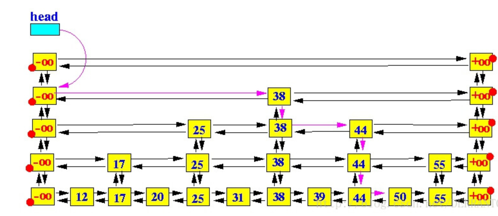
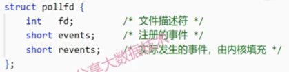

## Redis

### 1.Redis是什么，其优缺点

Redis是一个NoSQL型数据库，使用键值对的方式存储数据，由于其特异的数据结构，以及将数据存放在内存的存储方式，Redis的性能非常出色，是目前已知性能最快的KEY-VALUE数据库，被广大公司广泛使用为缓存。

优点：

- 高效的读写性能，因为其对数据结构的优化，加上是在内存上的操作
- 支持数据持久化，有AOF(append only file 将数据库操作命令存储起来)和RDB(redis database 将目前存在的数据快照保存)。
- 丰富的数据结构，其数据结构有基础数据结构String, Hash, List, Set, ZSet和Geo(地理位置), HyperLogLog(基数统计), Bitmaps(位图)

缺点：

- 数据库容量受内存限制，无法处理海量数据的缓存(目前没有较好的解决办法) 可选的有，使用连接池减少连接数量，采用分布式集群扩展内存，换成pika基于SSD存储。

### 2. Redis数据结构底层

1. String字符串 采用sds,其结构如下，最大长度为512MB(redis 6.2.7 将最大长度设置为从文件中读取，意味着没有最大长度限制？)

   

   优势：

   1. 获取长度时间复杂度为O(1)    (使用len记录长度)
   2. 优化空间重分配次数(预分配空间策略(分配的空间往往大于字符串实际使用的空间) 和惰性空间释放机制(并不实际重新分配空间，而是用free记录不被使用的空间))
   3. 杜绝缓冲区溢出(增加长度时，若超出范围自动扩容)
   4. 二进制安全(不以/0判断字符串是否结束，而是以sds.len)

2. List列表 3.2版本之前使用ziplist(数据量小时使用)和linkedlist(数据量大时使用)作为底层数据结构，3.2之后使用quicklist

   > ziplist: 连续的链表，类似于数组，但每个元素的大小可以不同，使用prelength记录上一个元素的长度，使用encodeing标识本元素类型，确定其长度。存在连锁更新问题，即前一节点的长度变化，导致后一节点的prelength所需位数不足，扩充导致本节点长度变化，从而引起连锁反应。

   >quicklist: ziplist与linkedlist的结合体，本质是linkedlist,使用ziplist作为linkedlist的节点
   list阻塞命令实现底层原理：占用与客户端的连接，却不发消息。

3. Hash哈希(类似于java中的对象) 自定义hash结构，没发现什么特点，类似于LIst，底层在ziplist与hashtable依据数据具体选择。

4. Set集合 底层使用hashtable(使用键存元素)与intset

   > intset：特殊的整形数组，依据内部整数的大小，动态选择所用int的位数，采用分查找来检索元素

5. ZSet有序集合 采用listpack(数据量小以及数据长度小) 和skiplist dick实现

   > listpack：对于ziplist的优化，取消了前一字段的长度，改为记录本字段的长度。

   > skiplist：优化查找时间为logn，对链表的二分查找，实现方法，维护上下左右指针

   

### 3.Redis为什么速度快

1. 基于内存的操作，所有数据保存在内存中
2. 采用单线程，减少了多线程导致的开销，如线程的创建和销毁，以及线程的切换
3. 高效的自定义数据结构，sds，listpack，skiplist
4. IO多路复用

### 4.Redis为什么使用单线程

首先理解为什么普通基于IO的存储模式为什么要多线程，目前IO的操作一般都是DMA，采用DMA模式时，CPU遇到IO请求时，只需要通知DMA，后续的操作完全不需要CPU管，因此进行IO操作时CPU是空闲的，若使用单线程，CPU将会一直空闲直到IO完成，利用率大大下降，所以一般使用多线程，当当前线程IO时，切换到另一个线程执行。

但是redis是在内存上的操作，没有IO，所有操作都需要CPU参与，因此CPU利用率已经很高了。

当然对于多核处理器，采用多线程也确实能提升效率，既然单线程已经够用，为什么要设计更复杂的多线程呢。

其他原因：减少线程切换开销，不用加影响性能的锁。

### 5.缓存三大问题及解决方法

1. 缓存穿透             大量访问数据库中不存在的数据，导致数据库崩溃

   方法一：缓存空值。

   ​	缺陷：造成内存大量消耗

   方法二：使用布隆过滤器，对于不存在的数据直接返回

   ​	缺陷：存在误判，无法删除数据(采用计数型)

2.缓存雪崩         同一时间大量key过期导致

​	解决方法：热点key不过期，key过期时间随机分散。

3. 缓存击穿：     热点数据过期，同时有大量对该数据的访问

   解决办法：1.定时主动刷新 2.分布式锁 3.jvm锁 4.jvm缓存加redis缓存

### 6.缓存一致性问题

缓存更新方案就是删除缓存与更新数据库的组合排列，都有各自的缺陷，简单点且效果好的为先更新数据库，后删除缓存。

延迟双删：先删除缓存，后更新数据库，一段时间后再次删除缓存。

### 7.非阻塞IO多路复用模型

IO多路复用的基础思想：在操作系统中，所有的设备都被抽象成文件，因此处理多个IO类似处理多个文件，我们只需要遍历每一个连接，判断是否有数据到达就行，至于如何判断某一连接是否有数据到达，交给内核态，系统函数，采用类似中断的形式？

select：采用1024位的bitmap记录有每个连接的描述符，max记录最大的描述符，在内核态从零遍历到max观察每个连接是否有数据到达，有则将bitmap相应为置1，返回，处理相应数据。

缺点：1.bitmap有长度限制。2.由于bitmap在内核态会被修改，因此每次都需要全部置0，在依据连接描述符重新赋值。3.频繁的用户态，内核态内存拷贝。 4.每次都要完全遍历，O(n)

poll：自定义了结构体，调用poll函数时，遍历结构体数组，将有事件的revents字段设置为1，返回处理完时间后将revents重新置0

相对于select，其解决了bitmap长度的限制，也省去了重复赋值，但依然没有解决后面两个问题

epoll：epoll_create：创建epollevent结构体，主要的存储结构，其中包括红黑树，和就绪队列

epoll_ctl：将连接加入到红黑树中，对其监听，注册响应回调函数

epoll_wait：返回已经就绪的节点

优点：1.只有初始加入连接时进行用户态到内核态的拷贝 2.从内核态返回时，只拷贝已就绪的连接 3.检查是否就绪采用的是回调函数，而不是轮询，复杂度为O(1)

### 8.线程模型

redis基于reactor模式开发了网络事件处理器，该处理器被称为文件事件处理器，其分为四个部分：1.多个套接字 2.IO多路复用程序 3.文件事件分派器 4.事件处理器

基本流程，使用IO多路复用程序监听多个套接字，有事件产生时，IO多路复用程序将其存放在队列中，分派器将队列中的事件分派给具体的事件处理器。

### 9.持久化

redis有两种持久化方式，分别是aof和rdb

AOF：将redis每次的写命令记录在服务器缓冲区中，之后同步到appendonly.aof中，下次重启时将文件中的命令自动执行一遍，开启方法：修改conf文件中的appendonly字段为yes，具体同步策略有三种，always：每次写命令立马同步，everysec：每秒同步一次，no：不主动同步，由磁盘自己同步。重启时执行命名的具体过程，就是制造出一个伪客户端模拟客户端的写命令。

RDB：对当前内存中的数据已快照的形式存入dump.rdb文件中，一般默认开启，可以在conf文件中修改其同步频率。也可以主动调用rdb快照，使用save(阻塞)和bgsave(不阻塞)命令。在下次程序启动时，会自动载入rdb文件。

### 10.AOF重写过程

由于redis的持续使用，以及数的更新，aof的大小会越来越大，其中也包括很多无用的内容，AOF重写就是删除其中无用的内容。

具体过程：创建一个子线程，重写过程交给子线程，具体过程就是读取当前数据库中的所有数据，根据数据倒推出命令，将其写入新的aof文件中，同时还会创造出一个缓存区，将目前redis正在执行的命令记录到缓存区中，所有数据处理完后，将缓存区的命令也加入到新的aof文件中，然后用新的aof文件替换旧的aof文件。

触发方式：通过手动输入bgrewriteaof主动进行aof重写。自动触发条件：没有bgsave或bgrewriteaof命令在执行，aof文件大小超过设置的值，aof文件大小相对最后一次重写的aof文件的大小增长率超过指定百分比，将会自动重写。

### 11.RDB与AOF如何选择

RDB优点：最大化redis性能，恢复大数据集也会更快

缺点：安全性不高

AOF优点：安全

缺点：会拉低redis效率，恢复速度慢。

依据数据可靠性要求和速度要求具体选择。

目前还有混合持久化，即重写时不翻译当前数据库，直接将rdb放入aof文件头。

### 12.redis什么时候阻塞

1. 慢查询：由于redis是单线程，当存在大量慢查询时，可能阻塞当前命令，可以查看slowlog来监控

2. 使用阻塞命令如save，keys之类

### 13.redis删除策略

1. 定时删除 ：设置定时器，时间到了就删除           对内存友好，但服务器压力很大
2. 惰性删除 ：取出键的时候才检测其是否过期       压力小，但内存不友好
3. 定时删除：每隔一段时间删除过期键        折中方案，但不好确定频率

目前redis默认删除方案为惰性删除和定期删除两种方案。

### 14.最大客户端连接

默认10000，可以修改max-clients字段来修改。

超出限制时，redis会拒绝新的连接，并报出错误

解决办法：优化连接，减少不必要的连接，或者使用集群

### 15.内存淘汰机制

redis内存受物理内存限制，同时也不会超过maxmemory限制

若超出maxmemory限制，则会触发指定的maxmemory-policy，常见的淘汰机制有以下几种

1. noeviction：仍要占用更多内存时返回错误
2. allkeys-lru：删除所有键中最不常使用的键
3. volatile-lru：删除有过期时间的键中最不常使用的键
4. allkeys-random：在所有键中随机删除
5. volatile-random：随机删除会过期的键
6. volatile-ttl：删除最快过期的键

当没有键会过期时，3,5,6方法会返回错误

默认是noeviction策略。

