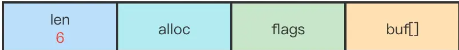

## Redis

### 1.Redis是什么，其优缺点

Redis是一个NoSQL型数据库，使用键值对的方式存储数据，由于其特异的数据结构，以及将数据存放在内存的存储方式，Redis的性能非常出色，是目前已知性能最快的KEY-VALUE数据库，被广大公司广泛使用为缓存。

优点：

- 高效的读写性能，因为其对数据结构的优化，加上是在内存上的操作
- 支持数据持久化，有AOF(append only file 将数据库操作命令存储起来)和RDB(redis database 将目前存在的数据快照保存)。
- 丰富的数据结构，其数据结构有基础数据结构String, Hash, List, Set, ZSet和Geo(地理位置), HyperLogLog(基数统计), Bitmaps(位图)

缺点：

- 数据库容量受内存限制，无法处理海量数据的缓存(目前没有较好的解决办法) 可选的有，使用连接池减少连接数量，采用分布式集群扩展内存，换成pika基于SSD存储。

### 2. Redis数据结构底层

1. String字符串 采用sds,其结构如下，最大长度为512MB(redis 6.2.7 将最大长度设置为从文件中读取，意味着没有最大长度限制？)

   

   优势：

   1. 获取长度时间复杂度为O(1)    (使用len记录长度)
   2. 优化空间重分配次数(预分配空间策略(分配的空间往往大于字符串实际使用的空间) 和惰性空间释放机制(并不实际重新分配空间，而是用free记录不被使用的空间))
   3. 杜绝缓冲区溢出(增加长度时，若超出范围自动扩容)
   4. 二进制安全(不以/0判断字符串是否结束，而是以sds.len)

2. List列表 3.2版本之前使用ziplist(数据量小时使用)和linkedlist(数据量大时使用)作为底层数据结构，3.2之后使用quicklist

   > ziplist: 连续的链表，类似于数组，但每个元素的大小可以不同，使用prelength记录上一个元素的长度，使用encodeing标识本元素类型，确定其长度。存在连锁更新问题，即前一节点的长度变化，导致后一节点的prelength所需位数不足，扩充导致本节点长度变化，从而引起连锁反应。

   >quicklist: ziplist与linkedlist的结合体，本质是linkedlist,使用ziplist作为linkedlist的节点
   list阻塞命令实现底层原理：占用与客户端的连接，却不发消息。

3. Hash哈希(类似于java中的对象)

   